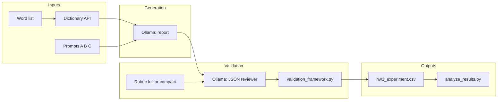

# Homework 3 — Validation experiment and documentation

This folder contains a **custom validation framework**, an **A/B/C prompt experiment** on dictionary-backed learner reports, **AI-as-reviewer** qualitative coding, and **statistical analysis** (ANOVA, pairwise *t*-tests, regression). It is inspired by `LAB_quality_control` (Ollama transport, JSON QC pattern) but uses **different scoring dimensions** and a **reproducible composite outcome** computed in Python.

---

## 1. Validation criteria table

| Dimension | Description | Scale / measurement | Benchmark (if applicable) |
| --- | --- | --- | --- |
| **evidence_alignment_index** | How tightly concrete claims in the report trace to the authoritative baseline JSON (pronunciations, types, definitions). Penalizes hallucinated senses, wrong IPA, or contradictions. | Integer **0–100** (higher = better alignment). | **≥ 72** contributes to `meets_benchmark_pass` (with coverage and risk). |
| **coverage_of_baseline_facets** | Extent to which important facets present in the baseline (e.g. multiple readings, POS rows, definitional nuance) appear in the prose. | Integer **0–100**. | **≥ 65** contributes to benchmark pass. |
| **clarity_tier** | Readability and structure for learners (independent of factual correctness). | Ordinal **1–4** (1 = dense / hard to skim … 4 = crisp hierarchy). | No single threshold in code; enters **composite_outcome** (see below). |
| **instructional_usefulness_band** | Pedagogical leverage *given* fidelity (mnemonics, drills, next steps tied to baseline content). | Ordinal **1–7** (1 = low guidance … 7 = high-leverage tutoring). | No hard pass band; enters **composite_outcome**. |
| **mislearning_risk_ordinal** | Residual risk that a learner leaves with a **wrong** belief despite tone. | Integer **0–3** (0 = negligible … 3 = severe). | **≤ 1** contributes to benchmark pass. |
| **thematic_tags** | Structured qualitative codes from a controlled vocabulary (e.g. `NOVICE_FRIENDLY`, `HALLUCINATION`). | List of tags (stored in CSV as `;`-separated string). | Not a numeric benchmark; supports qualitative analysis. |
| **qualitative_note** | Short reviewer synopsis referencing baseline vs. report. | Text (length-capped in pipeline). | Descriptive only. |
| **meets_benchmark_pass** | Boolean gate combining the three numeric bands above. | `True` / `False` | `True` iff alignment ≥ 72 **and** coverage ≥ 65 **and** mislearning_risk ≤ 1. |
| **composite_outcome** | Single **0–100** score for statistics (ANOVA / *t* / regression). | Float **0–100** | Not a pass/fail line; **primary dependent variable** for group comparisons. Computed in `validation_framework.py` as a weighted blend: **40%** alignment + **35%** coverage + **12%** clarity (normalized) + **13%** instructional usefulness (normalized) − **8** points per mislearning risk step, clipped to [0, 100]. |

### How this differs from the LAB’s Likert scales

| Aspect | **LAB** (`LAB_quality_control`, aligned with course R script) | **Homework 3** (this project) |
| --- | --- | --- |
| **Fidelity** | **accuracy**: Likert **1–5** (“problems interpreting data” … “no misinterpretation”). | **evidence_alignment_index**: **0–100** index focused on claim-to-JSON traceability, with explicit band text in the rubric. |
| **Readability** | **clarity**: Likert **1–5**. | **clarity_tier**: **1–4** ordinal tier (skimmability / structure), not the same wording or range. |
| **Relevance** | **relevance**: Likert **1–5**. | No single “relevance” Likert. Instead **coverage_of_baseline_facets** (0–100) and **instructional_usefulness_band** (1–7) split *what was covered* vs. *pedagogical payoff*. |
| **Boolean** | **accurate**: global true/false for misinterpretation. | **meets_benchmark_pass**: rule-based on **three** thresholds (alignment, coverage, risk). |
| **Risk** | Not a separate LAB dimension. | **mislearning_risk_ordinal** (0–3) explicitly scores false-learning risk. |
| **Qualitative** | Short **details** string. | **thematic_tags** + **qualitative_note** for systematic tagging vocabulary. |
| **Outcome for stats** | Means often reported per Likert dimension in LAB script. | One **composite_outcome** defined **deterministically in code** so every row’s primary outcome is reproducible from the six scored fields. |

---

## 2. Experimental design

### Research question (informal)

Among three different **system prompts** for generating the same kind of learner-facing word report from the same **baseline JSON**, which prompt produces reports that score higher on the **composite_outcome** (and related dimensions) under **AI review** against the baseline?

### Factors and conditions

| Factor | Levels |
| --- | --- |
| **Report prompt** | **A** — compression-first (`prompts/report_prompt_a.md`): very short bullets, minimal scope. |
| | **B** — rubric-balanced coach (`prompts/report_prompt_b.md`): structured mini-lesson (headline sense, pronunciation panel, meaning lattice, pedagogy, next step). |
| | **C** — narrative amplification (`prompts/report_prompt_c.md`): story-forward prose with sound/meaning paragraphs and a closing challenge. |

Prompt files are discovered automatically as `prompts/report_prompt_*.md` (sorted); labels are derived from the filename suffix (e.g. `a` → **A**).

### Stimuli (words)

Each run uses a list of **dictionary words**. The pipeline calls the same Word API + `_build_summary_for_llm` path as `Homework_1/word_reporter`, producing a **baseline JSON string** per word. Default lists:

- **Full run** (default if you do not pass `--words` or `--quick` / `--turbo`): 12 words (see `FULL_WORD_LIST` in `run_experiment.py`).
- **Quick / turbo presets**: 3 words (`QUICK_WORD_LIST`).

You can override with `--words w1 w2 ...`.

### How many validation scores per prompt?

For each **(word, prompt)** cell:

1. **One** generated report (unless generation fails).
2. **`qc_reps`** independent validator calls (default **1**). Each successful call yields **one row** in `results/hw3_experiment.csv` with all dimensions + `composite_outcome`.

So **validation scores per prompt** in the CSV = **(# words with successful baseline) × `qc_reps`**, summed across that prompt’s label. With default `qc_reps=1` and all 12 words succeeding for three prompts, you get **12 rows per prompt** (36 rows total), each with a full numeric score set.

### Sample size (*n* for statistics)

- **Unit of analysis** for ANOVA / *t*-tests / regression in `analyze_results.py`: each CSV row with a numeric **`composite_outcome`** and a **`prompt_label`** (A, B, C).
- **Total *n*** = number of such rows after dropping failed QC or empty composites.
- Increasing *n*: more `--words`, or `--qc-reps 2` (doubles validator rows per generated report), or multiple experiment runs merged into one CSV (if you align columns).

---

## 3. Statistical analysis

All tests are implemented in **`analyze_results.py`** on the **`composite_outcome`** column, grouped by **`prompt_label`**.

### Hypotheses (typical framing)

- **H₀ (ANOVA)**: Mean `composite_outcome` is the same for every prompt (A, B, C).  
- **H₁**: At least one prompt’s mean differs.

For pairwise comparisons (Welch *t*-test):

- **H₀**: μ_prompt_i = μ_prompt_j for that pair.  
- **H₁**: The two means differ.

For **OLS regression** with prompt dummies:

- **H₀** (per non-reference dummy): The coefficient for that prompt vs. the reference level is zero (no mean shift in `composite_outcome`).  
- **H₁**: Non-zero coefficient → that prompt’s average composite differs from the reference after controlling for the dummy structure used here.

### Procedures

| Procedure | Role |
| --- | --- |
| **One-way ANOVA** (`scipy.stats.f_oneway`) | Tests whether mean `composite_outcome` differs across **all** prompt groups simultaneously. |
| **Pairwise Welch *t*-tests** (`ttest_ind(..., equal_var=False)`) | Compares each pair of prompts without assuming equal variance. |
| **Bonferroni adjustment** | Multiplies each pairwise raw *p*-value by the number of pairwise tests *m* (caps at 1.0) to control family-wise error inflation. |
| **OLS with dummy variables** | Regresses `composite_outcome` on an intercept + dummies for each prompt except the **reference** category (**alphabetically first** label, usually **A**). Reports R², coefficients, standard errors, *t* statistics, and *p*-values for each dummy vs. reference. |
| **Thematic tag rollup** | Counts `thematic_tags` strings by `prompt_label` for a light qualitative summary in the text output. |

### How to obtain test results and interpret them

```bash
cd Homework_3
python3 analyze_results.py --text-out results/stats_summary.txt
```

- **ANOVA**: If the reported *p*-value is **small** (e.g. < 0.05), you reject H₀ and conclude that **mean composite differs among prompts** somewhere (follow up with pairwise tests or effect sizes).
- **Pairwise**: If **Bonferroni-adjusted *p*** is small for a pair, that pair’s mean composites are **statistically distinguishable** under this conservative correction.
- **Regression**: A significant negative coefficient for prompt **B** vs. reference **A** means **B’s average composite is lower than A’s** in this dataset (sign of the coefficient matters).

**Interpretation caveat:** Statistical significance depends on variance and *n*. A significant ANOVA does not tell you *which* prompt is “best” until you inspect means and pairwise results. Conversely, a non-significant result does not prove prompts are equivalent in the population—it may reflect insufficient power or noisy AI scoring.

---

## 4. System design

### End-to-end flow



1. **`run_experiment.py`** fetches word data, builds baseline JSON, and for each **(word, prompt)** calls **Ollama** with the report system prompt to produce a **learner report**.
2. The same script sends the **baseline JSON**, the **report**, and a **validator rubric** (full or compact) to Ollama as **JSON-mode structured output** (same transport selection pattern as the LAB: native chat, generate, or OpenAI-compatible endpoint).
3. **`validation_framework.parse_validator_json`** validates types/ranges, computes **`meets_benchmark_pass`** and **`composite_outcome`**, and normalizes tags.
4. Rows are appended to **`results/hw3_experiment.csv`** (gitignored by default except `.gitkeep`).
5. **`analyze_results.py`** reads the CSV and prints/writes the statistical summary.

### Role of the AI reviewer

The **AI reviewer** is a **second** Ollama call acting as a **structured rater**: it must output **only** JSON matching the schema (dimensions + tags + note). The pipeline does **not** trust free-form prose for scoring—numeric fields are **parsed and clamped** in Python. The reviewer’s role is to:

- Simulate a **systematic human-like** evaluation at scale across prompts and words.
- Supply **qualitative codes** (`thematic_tags`) and a **short justification** (`qualitative_note`) for transparency.

**Fast vs. rigorous QC** (see Usage): default **fast** mode uses a shorter rubric file, shorter system framing, optional truncation of very long baseline/report text **only in the validator context** (the stored CSV still contains the full generated report from the model output), and typically smaller token caps for JSON completion. **Rigorous** mode uses the full rubric and full context.

### Parallelism

Independent **(word, prompt)** jobs can run concurrently (`--parallel`, default 2). Generation + QC for a single cell still run **sequentially** inside that cell to preserve ordering of QC reps.

---

## 5. Technical details

### File structure

```
Homework_3/
├── DOCUMENTATION.md          ← this file
├── run_experiment.py         ← experiment driver (Ollama + API + CSV)
├── analyze_results.py       ← ANOVA, Welch t, Bonferroni, OLS, tag rollup
├── validation_framework.py  ← benchmarks, composite, JSON coercion
├── ollama_helpers.py         ← Ollama URLs, backend probe, chat wrappers
├── requirements.txt
├── .gitignore
├── prompts/
│   ├── custom_validator_rubric.md         ← full validator instructions
│   ├── custom_validator_rubric_compact.md ← fast QC variant
│   ├── report_prompt_a.md
│   ├── report_prompt_b.md
│   └── report_prompt_c.md
└── results/
    ├── .gitkeep
    └── hw3_experiment.csv   ← produced when you run the experiment (gitignored)
```

### Packages (`requirements.txt`)

- **requests** — Word API and Ollama HTTP.
- **python-dotenv** — load `.env` / `word.env` / `ollama.env`.
- **numpy**, **scipy** — ANOVA, *t*-tests, regression math in `analyze_results.py`.

### External services and credentials

| Dependency | Purpose | Setup |
| --- | --- | --- |
| **Ollama** (local) | Report generation + JSON validation | Install [Ollama](https://ollama.com), run the app or `ollama serve`, `ollama pull <model>`. Default base URL: `http://127.0.0.1:11434`. Override with **`OLLAMA_HOST`** or **`OLLAMA_PORT`**. |
| **Word API** (existing course stack) | `get_word_data` in `Homework_1/word_reporter` | Same as Homework 1 / LAB: place **`word.env`** (and keys as required by `api_client.py`) under `Homework_1/`, repo root, or `Homework_3/` so `python-dotenv` can find it. |

### Relevant environment variables (optional)

| Variable | Effect |
| --- | --- |
| `OLLAMA_MODEL` | Default `--model` for generation (and QC if `OLLAMA_QC_MODEL` unset). |
| `OLLAMA_QC_MODEL` | Smaller model **only** for validator JSON (throughput). |
| `OLLAMA_HOST` / `OLLAMA_PORT` | Ollama base URL / port. |
| `OLLAMA_TIMEOUT` | HTTP read timeout for Ollama calls. |
| `OLLAMA_PROBE_TIMEOUT` | Timeout for backend connectivity probe. |
| `OLLAMA_GEN_NUM_PREDICT` | Max new tokens for **report** generation (default 512 in code). |
| `OLLAMA_QC_NUM_PREDICT` | Max new tokens for **JSON QC** (default 384). |
| Legacy `OLLAMA_NUM_PREDICT` | If set and the split vars are unset, applies to both gen and QC caps in `ollama_helpers.py`. |

---

## 6. Usage instructions

### Step 1 — Install Python dependencies

```bash
cd Homework_3
python3 -m pip install -r requirements.txt
```

Use the same `python3` you will use to run the scripts.

### Step 2 — Configure Ollama

1. Start Ollama (macOS app or `ollama serve`).
2. Pull models you will use, for example:
   ```bash
   ollama pull gemma3:latest
   ollama pull llama3.2:3b
   ```
3. If probes fail or time out, see messages from `ollama_helpers.select_backend` and adjust **`OLLAMA_HOST`** / **`OLLAMA_PROBE_TIMEOUT`**.

### Step 3 — Configure dictionary / Word API

Copy or link your **`word.env`** (and any files `api_client.py` expects) so they are visible from **`Homework_1/word_reporter`** or parent paths (see `run_experiment.py` `load_dotenv` loop). Without valid keys, words will be **skipped** and the CSV may be empty.

### Step 4 — Run the experiment

**Fast smoke (recommended first run):**

```bash
python3 run_experiment.py --turbo --qc-model llama3.2:3b
```

**Default full word list (12 words), fast QC, parallel 2:**

```bash
python3 run_experiment.py
```

**Full validator rubric + untruncated QC context (slower, closer to “paper” rigor):**

```bash
python3 run_experiment.py --rigorous-qc --parallel 1
```

**Custom words and more QC replicates (larger *n* for stats):**

```bash
python3 run_experiment.py --words hello ecology ontology --qc-reps 2 --out results/my_run.csv
```

**Useful flags** (see also `run_experiment.py` module docstring):

| Flag | Meaning |
| --- | --- |
| `--quick` | 3-word list, no sleep between calls. |
| `--turbo` | 3 words, parallel ≥ 3, sleep 0. |
| `--parallel N` | Concurrent (word, prompt) jobs (default 2). |
| `--qc-model MODEL` | Validator-only model. |
| `--rigorous-qc` | Full rubric + full QC context. |
| `--sleep SEC` | Pause between Ollama calls in non-turbo quick paths. |
| `--qc-reps K` | *K* validator JSON calls per generated report. |
| `--out PATH` | Output CSV location. |

Output: **`results/hw3_experiment.csv`** (or your `--out` path). Columns include word, prompt, both models (if different), `validator_mode`, all dimensions, `composite_outcome`, and the full `report_text`.

### Step 5 — Run statistical analysis

```bash
python3 analyze_results.py
```

The default CSV path is **`Homework_3/results/hw3_experiment.csv`** (next to the script). Override with `--csv` if your file lives elsewhere.

Save a text report for your write-up:

```bash
python3 analyze_results.py --text-out results/stats_summary.txt
# or
python3 analyze_results.py --csv results/hw3_experiment.csv --text-out results/stats_summary.txt
```

Paste the console output or `stats_summary.txt` into your assignment: it contains per-prompt means, ANOVA *F* and *p*, pairwise Welch results with Bonferroni-adjusted *p*, OLS dummy regression vs. the reference prompt, and thematic tag counts.

### Troubleshooting (short)

| Symptom | What to try |
| --- | --- |
| `No working Ollama inference` | Start Ollama; fix `OLLAMA_HOST`; read probe lines in the error. |
| Read timeouts on first run | Increase `OLLAMA_PROBE_TIMEOUT`; warm the model once with `ollama run <model> hi`. |
| `[skip] word: ...` | Fix `word.env` / API keys; check network. |
| JSON / QC parse errors | Raise `OLLAMA_QC_NUM_PREDICT` slightly; try `--rigorous-qc`; try a stronger `--qc-model`. |
| Ollama errors under `--parallel 2+` | Use `--parallel 1`. |

---

## 7. Relation to `LAB_quality_control`

This homework reuses the **idea** of the LAB: markdown prompts, Ollama with JSON validation, CSV rows for analysis, and the same **dictionary baseline** path via `Homework_1/word_reporter`. It **replaces** the LAB’s **Likert + `accurate`** rubric with the **custom dimensions and composite** above, adds **three** report prompts (A/B/C), adds **statistics** in `analyze_results.py`, and adds **speed-oriented** options (compact rubric, parallelism, separate QC model) in `run_experiment.py`.

For the original LAB script behavior, see `LAB_quality_control/run_quality_control.py` and `LAB_quality_control/prompts/qc_rubric.md`.
